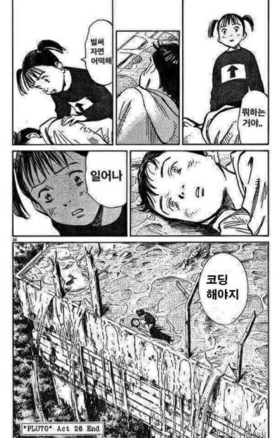

# Ch11. HTML 심화

## 웹 접근성

```html


<span>장바구니에 담기</span>
```

이미지만 있을 때는 alt를 작성하여 주고, 뒤에 텍스트로 설명이 되어 있다면 `alt=""` 이와 같이 처리해준다.

```css
.sr-only {
  position: absolute;
  width: 1px;
  height: 1px;
  padding: 0;
  margin: -1px;
  overflow: hidden;
  clip: rect(0, 0, 0, 0);
  white-space: nowrap;
  border-width: 0;
}
```

넓이와 높이를 0px로 줘도 되지만 스크린 리더기가 읽지 않을 수도 있기에 1px씩 주고 margin을 -1px 지정.

### aria-label 속성

페이지네이션과 같은 경우 현재 페이지가 어디인지 알려주는 기능으로 사용할 수 있다.

### aria-hidden 속성

스크린 리더기에만 감추고 싶다면 `aria-hidden`속성을 true로 지정하면 된다.

```html
<span aria-hidden="true">😼</span>환영합니다.
<div>I<span role="img" aria-label="love">💌</span>CODING</div>
```

스크린 리더가 읽게 해야하는 경우에는 `role`속성에 역할을 명시하고 `aria-label`속성에 스크린 리더가 읽어야할 텍스트를 넣으면 된다.

### figure 태그와 figcaption 태그

문서 내용과 연관성이 있지만 문서의 주요 흐름에는 영향을 주지 않는 이미지나 다이어그램, 오디오, 동영상 등의 미디어를 통틀어 정의할 때 사용

```html
<figure>
  
</figure>
<figcaption class="sr-only">PLUTO 만화 패러디: 일어나, 코딩해야지.</figcaption>
```

## 웹 접근성 참고 사이트

[W3C](https://www.w3.org/WAI/fundamentals/accessibility-intro/ko)

[NULI](https://nuli.navercorp.com/)

TODO: `LESSON 27. 가독성을 위한 이름 짓기` 부분은 Team By Team이겠지만 다시 보면 좋을 부분

BEM 방식 참고 사이트

- https://en.bem.info

- https://bem-cheat-sheet.9elements.com/
